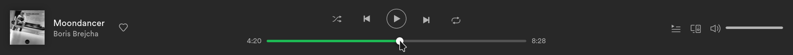
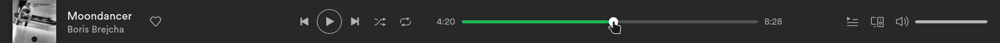

<!-- omit in toc -->
# UserScripts and UserStyles

- [SoundCloud Restore Playback](#soundcloud-restore-playback)
- [Spotify Player Compact](#spotify-player-compact)

# SoundCloud Restore Playback

Saves/restores playback position on SoundCloud.com

<!-- omit in toc -->
## Features

- Save playback position for each track with duration longer than 10 minutes
- Restore playback position on page load or track change, but not from last 30 seconds of the track

<!-- omit in toc -->
## Install

1. Install [Violentmonkey](https://violentmonkey.github.io/get-it/) browser extension
2. Click on [this link](https://raw.githubusercontent.com/crabvk/userscripts/master/soundcloud-restore-playback.user.js) (it'll open Violentmonkey)
3. Press "Confirm installation" in the right top corner

# Spotify Player Compact

Makes spotify player single row and changes player buttons order

Before

After

<!-- omit in toc -->
## Install

1. Install [Stylus](https://github.com/openstyles/stylus) browser extension
2. Click on [this link](https://raw.githubusercontent.com/crabvk/userscripts/master/spotify-player-compact.user.css) (it'll open Stylus)
3. Press "Install style" button in the left top corner
